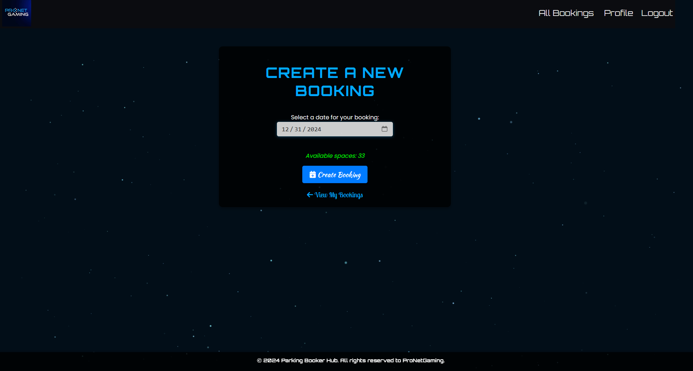
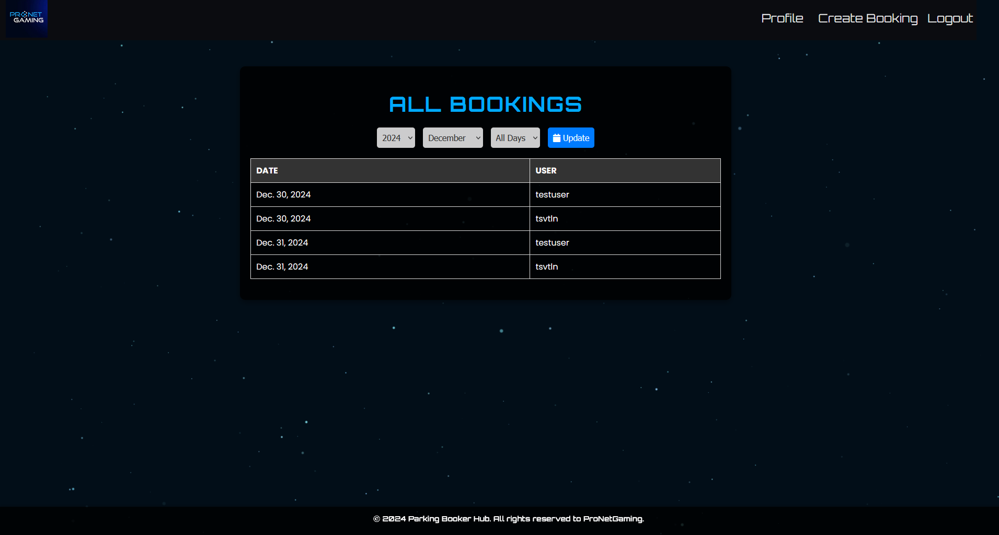

# Parking Booker Hub

Parking Booker Hub is a Django-based web application that allows users to create, manage, and view parking bookings. It offers a user-friendly interface with modern design elements, including interactive date selectors, user authentication, and role-based access.

## Features

- **User Authentication**: Register, log in, and manage profiles.
- **Booking Management**: Create bookings with real-time availability checks.
- **Interactive Calendar**: View all bookings filtered by year, month, and day.
- **Dynamic Feedback**: Live availability updates on the booking form.
- **Mobile-Responsive Design**: Accessible on all devices.
- **Admin Management**: Manage users, bookings, and system settings.

## Screenshots

### Homepage


### Create Booking


### View All Bookings


## Installation

### Prerequisites
- Python 3.8+
- Django 5.1+
- SQLite (default) or another database (optional)
### Required packages
```
asgiref==3.8.1
crispy-bootstrap4==2024.10
Django==5.1.4
django-crispy-forms==2.3
django-extensions==3.2.3
Markdown==3.7
pillow==11.0.0
psycopg2==2.9.10
psycopg2-binary==2.9.10
python-decouple==3.8
sqlparse==0.5.3
typing_extensions==4.12.2
tzdata==2024.2
```


## Features

### User Roles
1. **Standard User**:
   - Register an account.
   - Create and manage personal bookings.
   - View real-time availability while booking.
2. **Administrator**:
   - Access the admin dashboard.
   - Manage users, bookings, and system settings.

### Booking Workflow
1. Log in to your account.
2. Navigate to "Create Booking."
3. Select a date and view available slots.
4. Confirm the booking.


